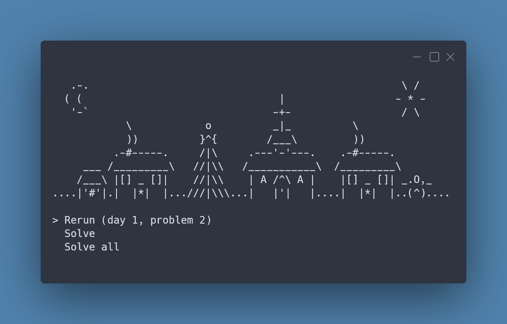

[](https://www.nuget.org/packages/AdventOfCode.Framework/)

# Advent of Code Framework

C# framework to interactively bootstrap Advent of Code solutions.

# Getting Started

The entry point to the framework is the `AdventOfCodeRunner`. From here you can either run in a full interactive mode
via `AdventOfCodeRunner.Run` or specify fixed options via methods like `AdventOfCodeRunner.Solve`. Solutions setup as
in [Solutions](#solutions) will be picked up automatically, but the runner will guide through this.



# Solutions

A `Solution` represents the logic to solve both problems for a particular puzzle day. Solutions should both implement
`ISolution` and be attributed with `SolutionAttribute` as follows:

```csharp
[Solution(Day = 1)]
internal class SampleSolution : ISolution
{
    /// <inheritdoc />
    public string SolveProblem1(ProblemInput input, ISolutionLogger logger)
    {
        ...
    }

    /// <inheritdoc />
    public string SolveProblem2(ProblemInput input, ISolutionLogger logger)
    {
        ...
    }
}
```

The solution attribute can also be used to enable/disable a solution and mark it as solved to deprioritize it in lists.

## Problems

Each solution has a 'solve' method for each problem, which can return a string output of the problem, or null if the
problem has not been solved.

Both the problem input and a logger are passed to the solve methods. The problem input can be consumed as either the
raw string, the input lines or a matrix (if the input is of fixed width and height):

```csharp
var inputRaw = input.Raw;
var inputLines = input.Lines;
var inputMatrix = input.Matrix;
```

Due to the interactive nature of the runner, writing to the console directly has undefined behaviour, whereas the logger
is compatible with the interactive console.

# Inputs and Outputs

When a problem is run for the first time, input and output files need to be provided. These are prompted for via Notepad
by the runner, and the user is expected to save and exit Notepad to continue (similar to command line Git). Initially
required files are the input and output of the example part of the problem, plus the input of the main problem (the file
will indicate the data expected).

After running the solution to the main problem the option will be given to save the output.

Inputs and outputs will be persisted at `%LocalAppData%\Advent of Code` and can be edited there if they require
updating.